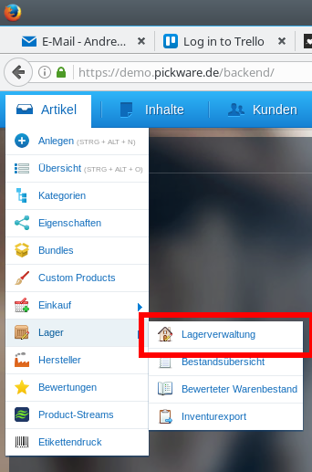

## Artikel
Um Artikel neu anzulegen auf *Artikel > Anlegen* gehen. Um bereits bestehende Artikel anzusehen oder zu bearbeiten auf *Artikel > Übersicht*.
#### Stammdaten
Am besten wird schon vorher der Hersteller des Artikels angelegt. Siehe [Hersteller anlegen](#hersteller).

Hersteller aus Drop-Down Menü auswählen.
Artikelbezeichnung angeben so wie sie im Shop erscheinen soll.
Artikelnummer wird von Shopware generiert.
Passenden Steuersatz wählen.
Falls vorhanden, Einkaufspreis angeben.
Soll es mehrere Varianten des Artikels geben, dann muss das Häkchen bei *Varianten-Artikel* gesetzt werden. Weitere Infos dazu unter [Variantenartikel](#variantenartikel).


Die Felder *Preisgruppe wählen* und *Preisgruppe aktiv* sind optional und dienen der Zuordnung zu z.B. Sonderaktionen.


**Wichtig:** Damit der Artikel im Shop erscheint muss das Häkchen bei *Artikel aktiv* gesetzt werden.

#### Preise
Preise können nach unterschiedlichen Kundengruppen zugeordnet werden. Das Anlegen von Kundengruppen ist hier beschrieben [Kundengruppen verwalten/anlegen](#kundengruppen).

Preise können absolut angegeben werden oder über eine Marge. Um Preise über eine Marge zu definieren muss ein Einkaufspreis gesetzt sein. Pseudopreise dienen für Sonderaktionen und sind optional.
Es lassen sich so auch Mengenrabatte definieren, indem das Feld *Bis* von *Beliebig* auf einen anderen Wert gesetzt wird.

**Beachte:** Preise sind Netto/Brutto je nach Einstellung in der Kundengruppe.

#### Beschreibung
Im Feld Beschreibung kann wie aus anderen Textverarbeitungsprogrammen gewohnt gearbeitet werden.

**Vorsicht:** Wenn Artikelbeschreibungen von anderen Webseiten einfach per *Copy/Paste* übernommen werden können ungewünschte Formatierungen resultieren. Daher ist es besser diese zuerst in einen anderen Texteditor zu kopieren und von dort aus weiter in das Feld zu kopieren. *(Externe Seite -> Copy/Paste -> Word -> Copy/Paste -> Shopware)*

**Vorsicht:** Niemals Bilder über *Drag'n'Drop* hinzufügen. Dazu die Medienverwaltung nutzen.


#### Meta Informationen
Diese Informationen dienen der besseren Auffindbarkeit über Suchmaschinen.

#### Einstellungen
In diesem Teil sind vor allem wichtig die *EAN Nummer* und die Option *Kundengruppen ausschließen*.
Damit ist es z.B. möglich Artikel wie Sandwiches nur für Kunden im Ladengeschäft zugänglich zu machen.

Außerdem kann hier ein *Mindestbestand* angegeben werden. Dies ist nützlich für die Warenwirtschaft, da so gleich Artikel zur Nachbestellung vorgeschlagen werden, die unter ihren Mindestbestand gefallen sind. Mehr dazu [hier](#lieferantenbestellung-erstellen).

#### Freitextfelder
Bieten die Möglichkeit weitere Felder in der Beschreibung hinzuzufügen.

### Kategorien
Über den Reiter *Kategorien* können Artikel ganz einfach Kategorien zugeordnet werden. Dazu links im *"Kategorien-Baum"* die gewünschte Kategorie auswählen und auf das Plus klicken. Alternativ ist die Zuweisung auch über *Drag'n'Drop* möglich.

### Bilder
Der Reiter *Bilder* ermöglicht das Hochladen von Bilder über einfaches *Drag'n'Drop*. Dabei können auch gleich mehrere Bilder auf einmal hochgeladen werden. Alternativ kann auch auf *Bild hinzufügen* geklickt werden.

Um Bilder bestimmten Varianten zuzuordnen muss ein Bild angewählt werden und dann auf *Konfiguration öffnen* geklickt werden.

Über *Als Vorschau verwenden* kann das Bild als Vorschaubild im Shop gewählt werden.

TODO: ausführlicher beschreiben wie zuordnung von bildern zu varianten erfolgt.

### Eigenschaften
Um die Artikel im Online-Shop nach bestimmten Eigenschaften filtern zu können müssen diese im Backend angelegt werden.
Zum Anlegen von Eigenschaften, die dann den Artikeln zugewiesen werden können, auf *Artikel > Eigenschaften* gehen.


Pro Artikel kann ein *Set* an Eigenschaften zugewiesen werden. Die Struktur ist dabei folgende:

Einem Artikel kann nur ein Set zugewiesen werden.

Ein Set kann beliebig viele Gruppen enthalten.
  + Gruppen können zB sein: Region, Geschmacksrichtung, Größe, Rebsorte, etc.

Gruppen beinhalten Optionen.
  + zB die Gruppe Rebsorte könnte die Optionen Dornfelder, Spätburgunder, Riesling etc. enthalten.

Wenn das gewünschte *Set* erstellt wurde kann es einem Artikel zugewiesen werden. Dazu muss der gewünschte Artikel über *Artikel > Übersicht* ausgewählt werden. Dann auf den Reiter *Eigenschaften* gehen.

Hier kann über das *Drop-Down*-Menü ein *Set* ausgewählt werden. Nun müssen nur noch die Eigenschaften, die auf den Artikel zutreffen ausgewählt werden.

**Beachte:** Nicht vergessen zu speichern bevor der Artikel wieder geschlossen wird.

#### Beispiel:
Als Beispiel möchten wir einem Wein Eigenschaften zuordnen.
Hierfür legen wir zunächste eine neue Gruppe für die Rebsorte an.
Nach Klick auf *Gruppe hinzufügen* geben wir den gewünschten Namen für die Gruppe ein. In unserem Fall 'Rebsorte'.


**Beachte:** Damit die Gruppe später als Filter verfügbar ist muss noch das Häkchen bei *Filterbar* gesetzt werden.

Dann über die Schaltfläche *Option hinzufügen* die gewünschten Rebsorten eintragen.


Über die Schaltfläche *Set hinzufügen* erstellen wir nun das Set das für unserem Artikel zuordnen wollen. Wir erstellen hier allgemeine Eigenschaften-Sets die am besten für ganz Produktgruppen verwendet werden können.
In unserem Fall nennen wir unser Set daher 'Weine'.


Über *Drag'n'Drop* können wir nun Gruppen einem Set zu ordnen. Dazu ziehen wir die in unserem Fall beide Gruppen *Region* und *Rebsorte* in die Spalte *Zugeordnete Gruppen*.


Nun öffnen wir den Artikel dem wir Eigenschaften zuordnen wollen. Im Reiter *Eigenschaften* wählen wir über das erste *Drop-Down* Menü unser gerade erstelltes *Set*. Dann kann eine Gruppe ausgewählt werden und eine Option dieser Gruppe. Durch *Eigenschaft erstellen* oder das Drücken auf *Enter* wird die Eigenschaft hinzugefügt.

**Beachte:** Es können auch Optionen hinzugefügt werden, die noch nicht eingepflegt wurden. Dazu einfach in dem Optionen-Eingabefeld die gewünschte Option eintippen und *Strg+Enter* drücken. Falls wir in unsrem Fall vergessen hätten die passende Rebsorte für den ausgewählten Wein anzulegen, könnten wir sie so trotzdem hinzufügen ohne noch einmal in den andren Dialog zu wechseln.


### Variantenartikel
Wurde im Feld *Stammdaten* das Häkchen bei *Varianten-Artikel* gesetzt und der Artikel gespeichert ist der Reiter *Varianten* verfügbar.
**Vorsicht:** Nicht vergessen auf *Speichern* zu klicken, damit der Reiter aktiv wird.


Um neue Varianten hinzuzufügen auf den Reiter *Konfiguration* gehen. Dort kann eine bestehende Variantengruppe gewählt oder eine neue angelegt werden. Zum Anlegen einfach den gewünschten Gruppennamen in das Feld neben *Gruppe erstellen* eingeben und auf *Enter* drücken.

**Beachte:** Gruppen sind Überbegriffe für Variantenmöglichkeiten. TODO Beispiel geben.[]


Die so erstellte Variantengruppe muss nun noch mit Varianten gefüllt werden. Dazu die frisch erstellte Gruppe anklicken und auf der rechten Seite im Feld *Option erstellen* die gewünschten Varianten eintragen und auf *Enter* drücken.

Es besteht noch die Möglichkeit auszuwählen wie die Kunden im Shop die verschiedenen Varianten auswählen können. Dazu oben links bei *Art des Konfigurators* die gewünschte Option wählen.

Um den Vorgang abzuschließen auf den Knopf *Varianten generieren* klicken. Shopware erstellt nun die verschiedenen Varianten.

TODO: Dialog speichern vor Generation.


## Stücklisten-Artikel (Körbe)
Stücklisten-Artikel werden genau wie normale Artikel angelegt. Also einfach auf *Artikel > Anlegen*. Der Haken bei Stückliste muss gesetzt sein.


Nach erfolgreichem abspeichern ist der Reiter *Stücklisten* verfügbar. Auf diesen Reiter klicken um die Stückliste mit Artikeln zu füllen.

**Beachte:** Zur weiteren Bearbeitung muss der Artikel erst abgespeichert werden. Falls der Reiter *Stücklisten* nicht verfügbar ist, den Artikel schließen und über *Artikel > Übersicht* erneut öffnen.

Die gewünschten Artikel können auf der linken Seite ausgewählt werden und durch Klick auf den Pfeil nach rechts in die Stückliste geschoben werden.

Die Anzahl der Artikel die in der Stückliste/Korb enthalten sein sollen kann durch Doppelklick auf das Feld *Anzahl* verändert werden.


**Beachte:** Nicht vergessen nach der Zuweisung der gewünschten Artikel oder nach Änderung der Anzahl abzuspeichern.


**TODO:** Wie können Sub-Artikel auf Emails/Rechnungen ein oder ausgeblendet werden.


## Gutscheine
### Erstellen eines Gutscheins im Laden
**sollen individuelle gutscheine erstellt werden?**

### Bearbeiten eines Gutscheins im Laden
In POS auf der Seite *Bezahlen* kann unter dem Feld *Rabatt & Gutschein* ein Gutschein hinzugefügt werden. Das kann über manuelle Eingabe oder durch scannen des Barcodes geschehen.

## Kunden
Neue Kunden können angelegt werden über *Kunden > Anlegen* oder *Kunden > Kunden > Hinzufügen*. Bereits bestehende Kunden können über *Kunden > Kunden* bearbeitet werden.

### Kundengruppen
Über *Einstellungen > Grundeinstellungen > Shopeinstellungen > Kundengruppen* können bestehende Kundengruppen bearbeitet oder neue angelegt werden.

Hier könnte zum Beispiel eine Kundengruppe für Stammkunden angelegt werden, die immer einen gewissen Rabatt erhalten.

## Bestellungen
**Ohne Pickware:** Bestellungen können unter *Kunden > Bestellungen* eingesehen werden. Hier besteht auch die Möglichkeit die Bestellungen nach verschiedensten Kriterien zu filtern.

Um eine Bestellung zu bearbeiten auf das Stift-Icon klicken.
Nun kann der Status der Bestellung im Reiter *Übersicht* angepasst werden (Zahlungsstatus und Versand).

Die einzelnen Artikel können über den Reiter *Positionen* eingesehen werden. Hier ist es auch möglich für jede individuelle Position den Status einzustellen (falls z.B. nur ein Teilversand mölgich ist)

**Mit Pickware:**


### Kommissionierung

### Rechnung erstellen
Unter dem Reiter *Dokumente* können die verschiedenen mit der Bestellung verknüpften Dokumente erstellt werden. Um beispielsweise eine Rechnung zu erstellen bei *Dokumenten-Typ* Rechnung wählen und auf *Dokument erstellen* klicken.
Das erstellte Dokument kann jetzt heruntergeladen werden.

### Bestellungen nach Kunden getrennt anzeigen
Um alle Bestellungen eines bestehenden Kunden einzusehen auf *Kunden > Kunden* gehen. Dort können auch alle Kunden einer bestimmte Kundengruppe angezeigt werden (z.B B2B-Kunden). Detail-Ansicht über Klick auf Stift-Symbol aufrufen und auf Reiter *Bestellungen* gehen. Dort können nach Zeitabschnitten gefiltert alle Bestellungen angezeigt werden.

```
Falls nur Bestellungen einer bestimmten Zahlart benötigt werden, können diese über einen Klick auf den Kopf der Spalte *Zahlart* sortiert werden. (Nützlich falls B2B-Kunden auch noch "normale" Einkäufe tätigen.)
```

## Hersteller
Liste aller Hersteller anzeigen oder neuen Hersteller hinzufügen unter:
*Artikel > Hersteller*

### Hersteller hinzufügen
Auf *Hinzufügen* klicken.

Nur *Herstellername* ist Pflichtfeld.

Alle weiteren Felder sind optional. Felder *URL, Beschreibung, Logo* werden im Shop angezeigt. Der Rest wird für Suchmaschinenoptimierung genutzt (ist also gut wenn diese ausgefüllt werden, aber auch kein Beinbruch wenn nicht).

## Lieferanten
Liste aller Lieferanten und neuen Lieferanten hinzufügen unter:
*Artikel > Einkauf > Lieferanten*

### Lieferant hinzufügen
Auf *Lieferant hinzufügen* klicken.

Felder soweit möglich ausfüllen -> *Speichern*.

Nun kann über den Editier-Knopf der Lieferant erneut aufgerufen werden und Artikel- und Herstellerzuordnung über die entsprechenden Reiter vorgenommen werden. Falls alle Artikel eines Herstellers von einem Lieferanten bezogen werden kann dies gleich über den Reiter *Herstellerzuordnung* umgesetzt werden.

#### Artikelzuordnung
Artikel der dem Lieferanten zugeordnet werden soll anklicken. Dann auf den Pfeil klicken um ihn zuzuordnen (nach rechts zu verschieben).

Wichtig: Hier können gleich Einkaufspreise und Standardbestellmenge eingetragen werden.

#### Herstellerzuordnung
Analog zu Artikelzuordnung. Hersteller auswählen und zuordnen. Dann auf *Alle Herstellerartikel dem Lieferanten zuordnen* klicken. Nun können die einzelnen Artikel im Reiter *Artikelzuordnung* bearbeitet werden.

### Lieferantenbestellung erstellen
Um eine Lieferantenbestellung zu erstellen auf *Artikel > Einkauf > Bestellwesen > Bestellung erstellen* klicken. Artikel mit einem gelben Warndreieck sind unter dem selbstdefifinierten Mindestbestand. Ein rotes Warnzeichen gibt an das mehr von einem Artikel bestellt wurde als aktuell auf Lager ist.


Artikel, die nachbestellt werden sollen, können per *drag and drop* oder mit Hilfe der Pfeile in der Mitte ausgewählt werden.
Wenn ein Lieferant für den Artikel hinterlegt ist, dann werden alle nötigen Felder automatisch ausgefüllt. Falls nicht, dann muss noch per Hand ein passender Lieferant gewählt werden.

Zum erstellen der Bestellungen einfach auf *Bestellung erzeugen* bzw. *Alle Bestellungen erzeugen* klicken.

Die Bestellung kann dann in *Artikel > Einkauf > Bestellwesen* weiter verarbeitet werden.

**Beachte:** Die Bestellung ist noch nicht versandt, hierfür ist noch ein extra Schritt nötig. Über die Icons in der Spalte rechts können die Bestellungen per Mail versendet, die Dokumente als PDF runtergeladen oder die Daten als CSV exportiert werden.

### Lieferung einlagern
Eine erhaltene Lieferung einzulagern ist über das Shopware Backend möglich oder in unserem Fall besser über Pickware Mobile mit der App *Lager*.

**Backend:** Einfach in *Artikel > Einkauf > Bestellwesen* den Status der betreffenden Bestellung auf *Komplett geliefert* setzen.

**Pickware Mobile:** Auf den Tab *Lieferungen* gehen. Wie bei Kommissionierung kann jede Position der Lieferantenbestellung einzeln bestätigt werden.
*Hinweis: Offene Mengen aus Lieferantenbestellungen im Status Komplett geliefert und Storniert / Abgeschrieben wird werden nicht mehr als im Zulauf betrachtet.*???

### Retouren
**Offene Fragen:** wird das benötigt?


## Lager
TODO: umlagern beschreiben


### Lieferantenbestellung bearbeiten
Für die Anpassung der Dokumente der Lieferantenbestellung sind zwei Einstellungen vorzunehmen

#### Einkaufspreise anzeigen


Gehe auf "Einstellungen->Grundeinstellungen->Weitere Einstellungen->Shopware ERP".


Setze "Bestellwesen - Artikelpreise in PDF/CSV-Export anzeigen" auf "Ja".

#### Abweichende Lieferadresse
Für abweichende Lieferadressen von der Geschäftsadresse muss mindestens eine Lageradresse definiert werden.
Wähle im Menü "Artikel->Lager->Lagerverwaltung".



##### Fall 1: Nur Ladengeschäft als Lieferadresse


Klicke auf das "Editieren"-Symbol des Hauptlagers und trage im Feld "Adresse" die Adresse des Ladengeschäfts ein.

##### Fall 2: Beibehalten der Geschäftsadresse als Option für Lieferungen.


Klicke auf Feld "Neues Lager erstellen". Lege neues Lager für das Ladengeschäft an und setze Haken beim Feld "Standardlager".


Das neue Lager ist ab sofort als Standard bei Bestellungen gewählt.

##### Beispiel für eine Lieferantenbestellung


(Als Absender wird weiterhin die Geschäftsadresse angegeben, die in den Stammdaten hinterlegt wurde.)


## Kassenberichte
Kassenberichte können über *Kunden > Kassenbericht* abgerufen werden. Es gibt hier die Möglichkeit per Hand einen Zeitraum (bestimmten Tag) zu wählen und dafür einen Abschluss zu erstellen.

**Beachte:** Es ist nicht schlimm wenn vergessen wird am Abend einen Abschluss zu erzeugen, da dies auch im Nachhinein nach Tagen getrennt zu tun. Nur der Zeitraum *Alles* darf nicht gewählt werden.

Alle abgeschlossenen Tage können über den Reiter *Abgeschlossen* aufgerufen werden. Um einen einzelnen Tagesabschluss einzusehen einfach auf die Lupe rechts in der Zeile klicken. In dem geöffneten Tagesabschluss besteht dann auch die Möglichkeit den Abschluss als PDF herunterzuladen.
